# 🌐 Nodes and Node Pools in Kubernetes (AKS)

## What is a Node?

- A **Node** is a **virtual machine (VM)** in your cluster.  
- It provides the **CPU, memory, storage, and networking** needed to run Pods (containers).  
- Each Node runs essential Kubernetes components such as:  
  - **kubelet** → communicates with the control plane and manages Pods  
  - **kube-proxy** → handles networking and routing traffic to Pods  

Think of a Node as the **worker machine** where applications actually run.  

---

## What is a Node Pool?

- A **Node Pool** is a **group of Nodes** with the same configuration.  
- All Nodes in a pool share:  
  - The same **VM size** (e.g., `Standard_DS2_v2`)  
  - The same **operating system** (Linux or Windows)  
  - The same **scaling rules** (min/max node count)  

In AKS, you can create multiple Node Pools to run different types of workloads, for example:  

- A **Linux pool** for general apps  
- A **Windows pool** for legacy apps  
- A **GPU pool** for machine learning or heavy computation  

---

## Relation between Node and Node Pool

- **Pods** (containers) are scheduled **onto Nodes**.  
- **Nodes** belong to a **Node Pool**.  
- **Node Pools** belong to the **Cluster**.  

## FLOW

```mermaid

flowchart LR
    %% Entrada
    User["User Request"] --> CLB["Cloud Load Balancer"]

    %% Services
    CLB --> WebServer["K8s Service: webserver"]
    CLB --> PingService["K8s Service: pingservice"]
    CLB --> PongService["K8s Service: pongservice"]

    %% API Layer destacado como Post-it
    WebServer --> K8sAPI["K8s API abstraction
--------------------------
🔹 Decides which Pod runs where
🔹 Talks to kube-proxy / scheduler
🔹 Routes traffic to the right Node"]:::api
    PingService --> K8sAPI
    PongService --> K8sAPI

    %% Node Pool (camada abaixo do API)
    subgraph NodePool["Nodes Pool (2 to 5 VMs)"]
        VM1["VM 1 (Node 1)"]
        VM2["VM 2 (Node 2)"]
        VM3["VM 3 (Node 3)"]
    end

    %% Pods dentro de cada Node
    VM1 --> WebPod1["Webserver Pod 1"]:::web
    VM1 --> PingPod1["Pingservice Pod 1"]:::ping

    VM2 --> WebPod2["Webserver Pod 2"]:::web
    VM2 --> PongPod1["Pongservice Pod 1"]:::pong

    VM3 --> PingPod2["Pingservice Pod 2"]:::ping
    VM3 --> PongPod2["Pongservice Pod 2"]:::pong

    K8sAPI --> VM1
    K8sAPI --> VM2
    K8sAPI --> VM3

    %% Estilos
    classDef web fill:#3b82f6,stroke:#1e40af,color:white,font-weight:bold;
    classDef ping fill:#22c55e,stroke:#166534,color:white,font-weight:bold;
    classDef pong fill:#f97316,stroke:#7c2d12,color:white,font-weight:bold;
    classDef api fill:#fff3b0,stroke:#d4aa00,stroke-width:1px,color:#000,font-weight:bold;

```



# 🔎 Checking Pods per Node in AKS

When running workloads in Azure Kubernetes Service (AKS), it is often useful to know **how many Pods are running on each Node (VM)**.  
Below are some useful `kubectl` commands for investigating Pod distribution.

---

## 1. List all Nodes in the Cluster
```bash
kubectl get nodes -o wide
```
This shows:
- Node name  
- Status  
- Internal IP  
- OS / kernel version  
- VM size  

---

## 2. List all Pods and their assigned Nodes
```bash
kubectl get pods -o wide -A
```
Options explained:  
- `-A` → show Pods across **all namespaces**  
- `-o wide` → include extra details, such as the **Node** column  

This lets you see exactly which Pod is running on which Node.

---

## 3. Count how many Pods are running per Node
```bash
kubectl get pods -o wide -A | awk '{print $8}' | sort | uniq -c
```
Explanation:  
- Column `$8` corresponds to the Node name  
- `sort` groups them together  
- `uniq -c` counts how many times each Node appears  

Example output:
```
   12 aks-nodepool1-12345678-vmss000000
   15 aks-nodepool1-12345678-vmss000001
   10 aks-nodepool1-12345678-vmss000002
```

---

## 4. Check Node resource usage (CPU & Memory)
```bash
kubectl top node
```
This shows CPU and memory utilization per Node.  
⚠️ Requires the **metrics-server** to be installed in your cluster.

---

✅ With these commands you can quickly determine **Pod distribution and Node utilization** in your AKS cluster.
