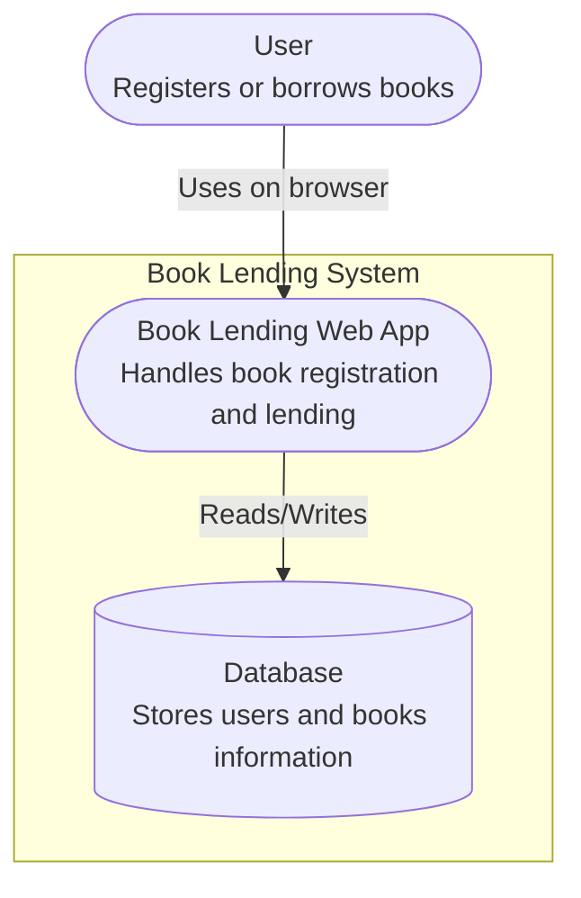
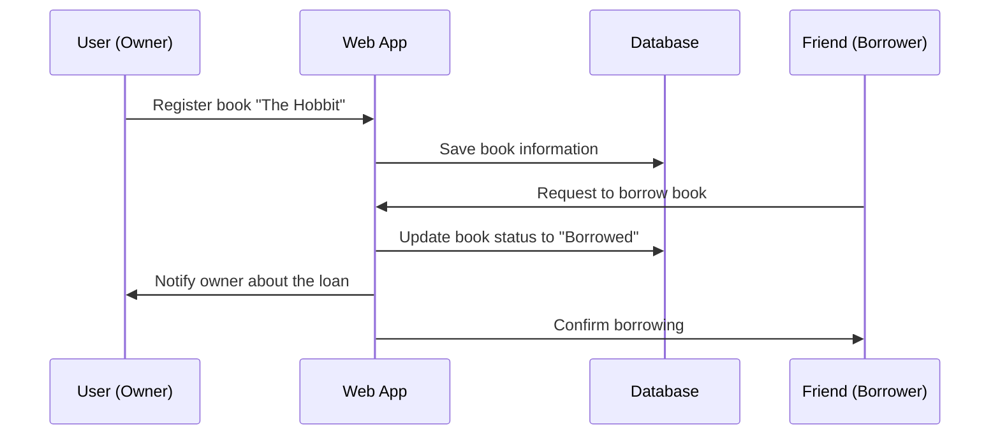
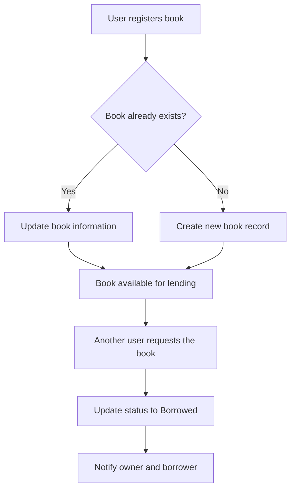

# Go Gin Example | Fábio R. Nóbrega

This project is a simple example using [Gin Web Framework](https://github.com/gin-gonic/gin) in Go 1.23. The goal is to build a lightweight web API with hot reload support using Docker and `air`.

We use:  
- Go: 1.23  
- Gin: v1.10.1  
- Docker + Docker Compose  
- Air for live reload

## Table of contents
=================

  * [Install](#install)  
  * [Usage](#usage)  
  * [Tests](#tests)
  * [Architecture](#architecture)
  * [Troubleshooting](#troubleshooting)  
  * [Git Guideline](#git-guideline)  

## Install

+ Clone the repo and cd into the project:

```bash
git clone https://github.com/FabioRNobrega/go-gin-example.git
cd go-gin-example
```

+ Make sure Docker and Docker Compose are installed.

+ Build and run the container with:

```bash
make docker-up
```

This will start the app on port 8080 with hot reload enabled.


## Usage

+ Access the API at:

```
http://localhost:8080/
```

+ Example endpoints:

- `GET /ping` - returns a pong response  
- `GET /user/:name` - returns a personalized greeting  

+ To stop the container:

```bash
make docker-down
```

## Tests

It's never too early to begin running unit tests. You can learn how to implement tests using Go's built-in testing framework on [Go Testing](https://pkg.go.dev/testing).

## Architecture 

1. C4 – Container Diagram adapted with flowchar to renden on github


2. Sequence Diagram – Book Lending Flow



4. Activity Diagram



6. Class Diagram

 ```mermaid
classDiagram
    class User {
        +String name
        +String email
        +List<Book> books
        +lendBook()
        +requestBook()
    }

    class Book {
        +String title
        +String author
        +String status
        +User owner
    }

    User "1" -- "*" Book : owns
    Book "1" -- "1" User : borrowed_by
```


## Troubleshooting

- If you cannot access the API via `localhost:8080`, verify that the Docker container is running and the port is correctly exposed in `docker-compose.yml`.

- For any permission issues with SSH, make sure your `~/.ssh` keys are correctly mounted into the container.


## Git Guideline

Create your branches and commits using English and follow this guideline:

### Branches
- Feature:  `feat/branch-name`  
- Hotfix: `hotfix/branch-name`  
- POC: `poc/branch-name`  

### Commit prefixes
- Chore: `chore(context): message`  
- Feat: `feat(context): message`  
- Fix: `fix(context): message`  
- Refactor: `refactor(context): message`  
- Tests: `tests(context): message`  
- Docs: `docs(context): message`  
