# Go Gin Ping Pong | Fábio R. Nóbrega  

This project is a simple **microservice playground** built with [Gin Web Framework](https://github.com/gin-gonic/gin) in Go 1.23.  
The goal is to demonstrate how to structure multiple services (Ping, Pong, and Web UI) with **Docker Compose**, **htmx**, **Shoelace**, and **Air** (for hot reload).  

We use:  
- Go: 1.23  
- Gin: v1.10.1  
- Docker + Docker Compose  
- Air for live reload  
- htmx + Shoelace for frontend  

---

## Table of contents

* [Install](#install)  
* [Usage](#usage)  
* [Architecture](#architecture)  
* [Troubleshooting](#troubleshooting)  
* [Git Guideline](#git-guideline)  

---

## Install

Clone the repo and cd into the project:

```bash
git clone https://github.com/FabioRNobrega/go-gin-example.git
cd go-gin-example
```

Make sure Docker and Docker Compose are installed.  

Build and run the stack with:

```bash
make docker-up
```

This will start **3 services** with hot reload:  
- **webservice** → UI + API Gateway (port 8080)  
- **pingservice** → returns 🏓 "Hello World, I'm the ping service" (port 8081)  
- **pongservice** → returns 🏓 "Hello World, I'm the pong service" (port 8082)  

Stop everything with:

```bash
make docker-down
```

---

## Usage

Access the UI at:

```
http://localhost:8080/
```

On the screen you’ll see:
- **Blue side** → Ping button  
- **Green side** → Pong button  
- A central ball 🏐 that moves left/right depending on which button you click.  
- The ball displays the message returned by the microservice.  

Example endpoints (if called directly):  
- `GET http://localhost:8080/call-ping` → forwards request to `pingservice`  
- `GET http://localhost:8080/call-pong` → forwards request to `pongservice`  

---

## Architecture 

### Service Relationship Diagram  

```mermaid
flowchart LR
    user([User<br/>Browser])
    web([WebService<br/>UI + API Gateway])
    ping([PingService<br/>🏓 Ping])
    pong([PongService<br/>🏓 Pong])

    user --> web
    web --> ping
    web --> pong
```



---

## Troubleshooting

- If you cannot access the UI via `localhost:8080`, verify that all containers are up with `docker ps`.  
- Inside Docker, services resolve each other by **service name** (`pingservice:8081`, `pongservice:8082`).  
- If hot reload fails, ensure `air` is installed and available in the container.  

---

## Git Guideline

Create your branches and commits using English and follow this guideline:

### Branches
- Feature:  `feat/branch-name`  
- Hotfix: `hotfix/branch-name`  
- POC: `poc/branch-name`  

### Commit prefixes
- Chore: `chore(context): message`  
- Feat: `feat(context): message`  
- Fix: `fix(context): message`  
- Refactor: `refactor(context): message`  
- Tests: `tests(context): message`  
- Docs: `docs(context): message`  
